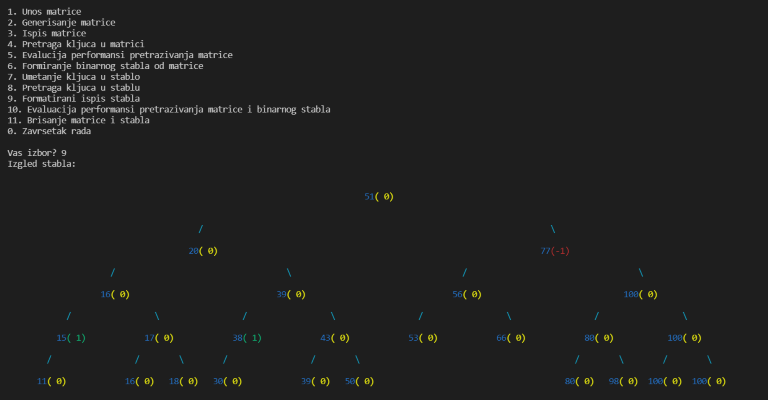

# AVL-tree
- Implemented a set of AVL-tree algorithms in C for key nding and performance evaluation.
- Created a function for intuitive and colorful tree printing that showcases the state of the AVL-tree.
- Designed and wrote a command-line menu for interactive use of the above mentioned algorithms.

